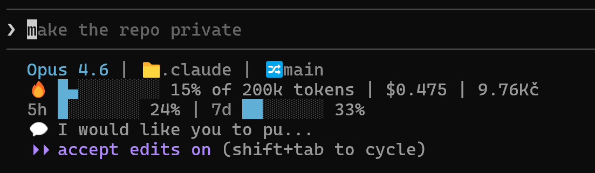

# Claude Code Custom Configuration

## Custom Status Line



3-line status bar showing:
- **Line 1**: Model, directory, git branch
- **Line 2**: Context usage bar (█/░), % tokens, session cost (USD/CZK)
- **Line 3**: 5-hour & 7-day quota utilization

Configured via `scripts/context-bar.sh`.

## Skills

### mpx- (Spec-Driven Workflow)

| Skill | Description |
|-------|-------------|
| `/mpx-init-project` | Full project setup (spec + git + phases) |
| `/mpx-create-spec` | Interactive spec creation |
| `/mpx-init-repo` | Initialize git repo |
| `/mpx-parse-spec` | Parse SPEC.md → ROADMAP.md + phases |
| `/mpx-execute-task` | Select phase, execute next task |
| `/mpx-show-project-status` | Show progress |
| `/mpx-add-requirements` | Add requirements with conflict detection |
| `/mpx-handoff` | Update STATE.md with session handoff info |

### mp- (General Purpose)

| Skill | Description |
|-------|-------------|
| `/mp-commit` | Stage and commit with conventional format |
| `/mp-pr-create` | Create draft PR from existing commits |
| `/mp-commit-push-pr` | Full workflow - commit, push, create draft PR |
| `/mp-review-branch` | Multi-agent code review |
| `/mp-review-pr` | PR review |
| `/mp-review-design` | Visual design inspection via chrome-devtools |
| `/mp-gh-issue-fix` | Investigate and fix GitHub issues |
| `/mp-update-readme` | Update README.md |
| `/mp-update-instructions` | Analyze history, improve CLAUDE.md/AGENTS.md |
| `/mp-gemini-fetch` | Fetch blocked sites via Gemini CLI |

## Workflow

```
┌─────────────────────────┐
│  /mpx-init-project      │  ◄── Start here for new projects
└────────┬────────────────┘
         │
         ▼
┌─────────────────────────┐
│  /mpx-create-spec       │  ◄── Interactive tech stack Q&A
└────────┬────────────────┘
         │
         ▼
┌─────────────────────────┐
│  /mpx-init-repo         │  ◄── Git setup
└────────┬────────────────┘
         │
         ▼
┌─────────────────────────┐
│  /mpx-parse-spec        │  ◄── Generate ROADMAP.md + phases
└────────┬────────────────┘
         │
         ▼
┌─────────────────────────┐
│  /mpx-execute-task      │  ◄── Execute tasks (loop)
└────────┬────────────────┘
         │
         ▼
┌─────────────────────────┐
│  /mpx-show-project-status │  ◄── Check progress anytime
└─────────────────────────┘
```

## Project Structure

All projects use phase-based organization:

```
.mpx/
├── SPEC.md              # Master project specification
├── ROADMAP.md           # Phase overview + high-level tracking
├── STATE.md             # Global state + session handoff
└── phases/
    ├── 01-foundation/
    │   ├── SPEC.md      # Phase requirements
    │   ├── CHECKLIST.md # Phase tasks
    │   └── STATE.md     # Phase state + session handoff
    ├── 02-core-feature/
    │   ├── SPEC.md
    │   ├── CHECKLIST.md
    │   └── STATE.md
    └── 03-polish/
        ├── SPEC.md
        ├── CHECKLIST.md
        └── STATE.md
```

**Key files:**
- `ROADMAP.md` - tracks phase completion (Status column)
- `STATE.md` - includes session handoff section
- Each phase folder has its own `CHECKLIST.md` for task tracking

## Usage Examples

```bash
# Start a new project
/mpx-init-project

# Or step by step:
/mpx-create-spec           # Create specification
/mpx-init-repo             # Initialize git
/mpx-parse-spec            # Generate ROADMAP.md + phases

# Execute tasks
/mpx-execute-task           # Select phase, execute next task

# Check progress
/mpx-show-project-status    # See progress and next steps

# Add new requirements mid-project
/mpx-add-requirements "Add dark mode support"

# Review skills
/mp-review-branch         # Review current branch
/mp-review-pr 123         # Review specific PR
```

## Review Skills Details

### Safety Guarantees

**Review skills are read-only:**
- No files are modified
- No commits are made
- No GitHub comments are posted
- No PRs are approved/rejected

Only `/mp-update-readme` can modify files (the README.md).

### Review Categories

Both review skills check:
1. **Tech Stack Best Practices** - Framework-specific patterns
2. **Security** - OWASP top 10, injection, XSS, auth issues
3. **Performance** - N+1 queries, memory leaks, bundle size
4. **Error Handling** - Try/catch, boundaries, graceful degradation
5. **Code Quality** - DRY, complexity, naming, CLAUDE.md compliance

### Confidence Scoring

Issues are scored 0-100:
- **Top (>80)**: Must fix before merge
- **High (66-80)**: Should address
- **Medium (40-65)**: Worth reviewing
- **Low (<40)**: Stylistic or minor

## Agents

| Agent | Model | Description |
|-------|-------|-------------|
| mpx-executor | Opus | Executes tasks with fresh context |
| mpx-spec-analyzer | Sonnet | Analyzes specs and creates phase structure |
| mp-gh-issue-analyzer | Opus | Analyzes GitHub issues, creates fix plans |
| mp-context7-docs-fetcher | Sonnet | Fetches library docs via Context7 MCP |
| mp-css-layout-debugger | Haiku | CSS layout debugging |
| mp-bash-script-colorizer | Haiku | Bash script coloring guidelines |
| mp-ux-designer | - | UX research and design artifacts |
